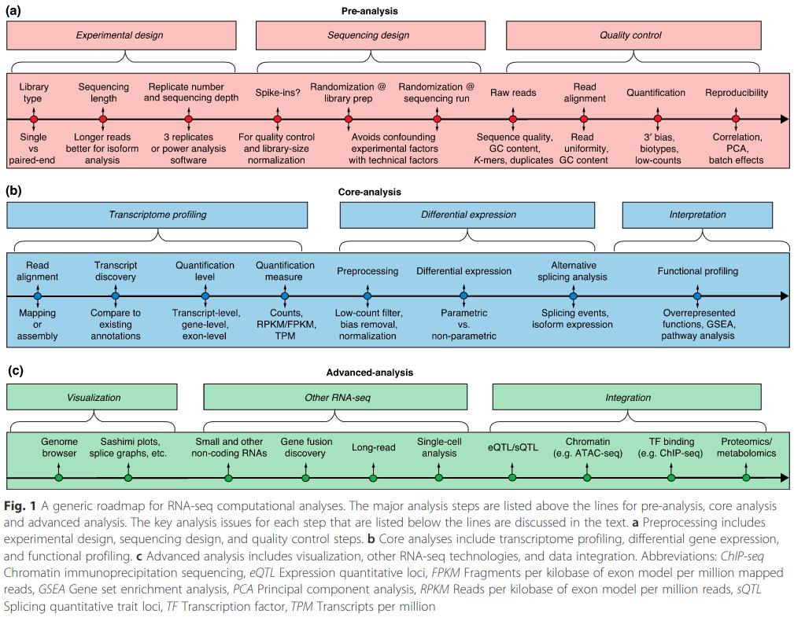
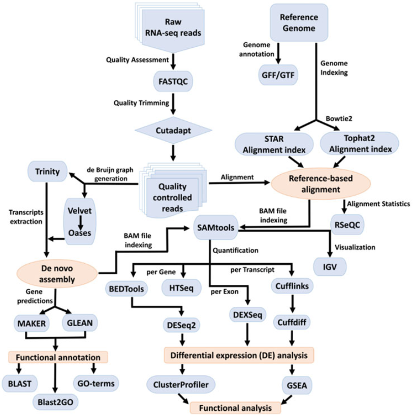
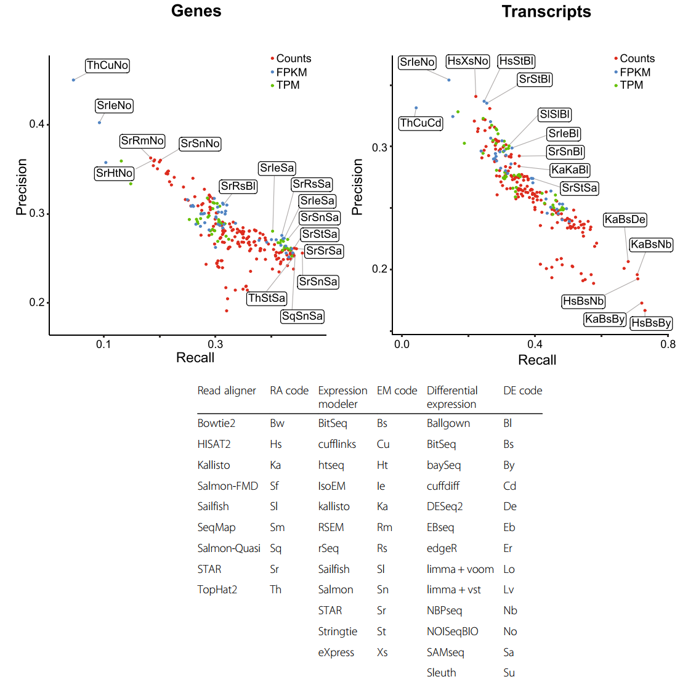

# Useful resources 

 - :fire: Must read/watch
 - :heavy_check_mark: Open access

## Articles
 1. :heavy_check_mark: :fire: Van den Berge K, Hembach KM, Soneson C, Tiberi S, Clement L, Love MI, Patro R, Robinson MD. **RNA Sequencing Data: Hitchhiker's Guide to Expression Analysis**. Annual Review of Biomedical Data Science 2019, **2**:1, 139-173. https://doi.org/10.1146/annurev-biodatasci-072018-021255
 2. :heavy_check_mark: Seyednasrollah F, Laiho A, Elo LL. **Comparison of software packages for detecting differential expression in RNA-seq studies**. Briefings in Bioinformatics 2015, **16**:1, 59–70. https://doi.org/10.1093/bib/bbt086
 3. :heavy_check_mark: Ritchie ME, Phipson B, Wu D, Hu Y, Law CW, Shi W, Smyth GK. **limma powers differential expression analyses for RNA-sequencing and microarray studies**. Nucleic Acids Research 2015, **43**:7. https://doi.org/10.1093/nar/gkv007
 4. :heavy_check_mark: :fire: McDermaid A, Monier B, Zhao J, Liu B, Ma Q. **Interpretation of differential gene expression results of RNA-seq data: review and integration**. Briefings in Bioinformatics 2019, **20**:6, 2044–2054. https://doi.org/10.1093/bib/bby067 
 5. :heavy_check_mark: Edwards DJ, Holt KE. **Beginner’s guide to comparative bacterial genome analysis using next-generation sequence data**. Microbial Informatics and Experimentation 2013, **3**:2. https://doi.org/10.1186/2042-5783-3-2
 6. :heavy_check_mark: Krampis K, Wultsch C. **A Review of Cloud Computing Bioinformatics. Solutions for Next-Gen Sequencing Data Analysis**. Methods Next-Generation Sequensing 2015; **2**:1, 23–34. https://doi.org/10.1515/mngs-2015-0003
 7. :heavy_check_mark: Qi R, Ma A, Qin Ma Q, Zou Q. **Clustering and classification methods for single-cell RNA-sequencing data**. Briefings in Bioinformatics 2020, **21**:4, 1196–1208. https://doi.org/10.1093/bib/bbz062
 8. :heavy_check_mark: Giancarlo R, Rombo SE, Utro F. **Compressive biological sequence analysis and archival in the era of high-throughput sequencing technologies**.  Briefings in Bioinformatics 2014, **15**:3, 390–406. https://doi.org/10.1093/bib/bbt088
 9. :heavy_check_mark: Zhu Z, Zhang Y, Zhen Ji Z, He S, Yang X. **High-throughput DNA sequence data compression**. Briefings in Bioinformatics 2015, **16**:1, 1–15. https://doi.org/10.1093/bib/bbt087
 10. :heavy_check_mark: Law CW, Chen Y, Wei Shi W, Smyth GK. **voom: precision weights unlock linear model analysis tools for RNA-seq read counts**. Genome Biology 2014, **15**:R29. https://doi.org/10.1186/gb-2014-15-2-r29
 11. :heavy_check_mark: Soneson C, Love MI and Robinson MD. **Differential analyses for RNA-seq: transcript-level estimates improve gene-level inferences**. F1000Research 2016, **4**:1521. https://doi.org/10.12688/f1000research.7563.2
 12. :heavy_check_mark: Dominguez Del Angel V, Hjerde E, Sterck L et al. **Ten steps to get started in Genome Assembly and Annotation**. F1000Research 2018, **7**(ELIXIR):148. https://doi.org/10.12688/f1000research.13598.1
 13. :heavy_check_mark: Compeau PEC, Pevzner PA, Tesler G. **How to apply de Bruijn graphs to genome assembly**. Nature Biotechnology 2011, **29**:11. https://doi.org/10.1038%2Fnbt.2023 (free version is available on [NCBI](https://www.ncbi.nlm.nih.gov/pmc/articles/PMC5531759/))
 14. :heavy_check_mark: Conesa A, Madrigal P, Tarazona S, et al. **A survey of best practices for RNA-seq data analysis**. Genome Biology 2016, **17**:13. https://doi.org/10.1186/s13059-016-0881-8 

## Workflows
 1. :heavy_check_mark: :fire: Love MI, Anders S, Kim V and Huber W. **RNA-Seq workflow: gene-level exploratory analysis and differential expression**. F1000Research 2016, **4**:1070. https://doi.org/10.12688/f1000research.7035.2
 2. :heavy_check_mark: Law CW, Alhamdoosh M, Su S et al. **RNA-seq analysis is easy as 1-2-3 with limma, Glimma and edgeR**. F1000Research 2018, **5**:1408 https://doi.org/10.12688/f1000research.9005.3
 3. :heavy_check_mark: Lun A, Davis J. McCarthy D, Marioni J. **A step-by-step workflow for low-level analysis of singlecell RNA-seq data with Bioconductor**. F1000Research 2016, **5**:2122. https://doi.org/10.12688/f1000research.9501.2
 4. Chen Y, Lun ATL and Smyth GK. **From reads to genes to pathways: differential expression analysis of RNA-Seq experiments using Rsubread and the edgeR quasi-likelihood pipeline**. F1000Research 2016, **5**:1438. https://doi.org/10.12688/f1000research.8987.2
 5. Collado-Torres L, Nellore A and Jaffe AE. **recount workflow: Accessing over 70,000 human RNA-seq samples with Bioconductor**. F1000Research 2017, **6**:1558. https://doi.org/10.12688/f1000research.12223.1  

## Books
 1. :fire: Korpelainen E, Tuimala J, Somervuo P, Huss M, Wong G. **RNA-seq Data Analysis. A Practical Approach**. Chapman & Hall/CRC Mathematical and Computational Biology Series, 2014. ISBN 978-1-4665-9501-9.
 2. Kappelmann-Fenzl M. **Nex Generation Sequencing and Data Analysis**. Springer, 2021. ISBN 978-3-030-62489-7.
 3. Sung W. **Algorithms for Next-Generation Sequencing**. Chapman & Hall/CRC Mathematical and Computational Biology Series, 2017. ISBN 978-1-4665-6550-0.
 4. Masoudi-Nejad A, Zahra Narimani Z, Hosseinkhan N. **Next Generation Sequencing and Sequence Assembly. Methodologies and Algorithms**. Springer Briefs in Systems Biology, 2013. ISBN 978-1-4614-7725-9.
 5. Low l, Tammi M. **Bioinformatics: a practical handbook of next generation sequencing and its applications**. World Scientific, 2017. ISBN 9789813144743.
 6. :heavy_check_mark: :fire: Amezquita R, Lun A, Hicks S, Gottardo R. **Orchestrating Single-Cell Analysis with Bioconductor**. Bioconductor, 2020. https://github.com/Bioconductor/OrchestratingSingleCellAnalysis

## Videos
1. :heavy_check_mark: :fire: Simpson J. **Fundamentals of Genome Assembly**. Bioinformatics DotCa (51 min). https://www.youtube.com/watch?v=5wvGapmA5zM
2. :heavy_check_mark: Simpson J. **De novo assembly**. Dioinformatics DotCa (56 min). https://www.youtube.com/watch?v=sysnKQvqmnk
3. :heavy_check_mark: Chimenti M. **Introduction to RNA-Seq for Researchers**. Iowa Institute of Human Genetics (31 min). https://www.youtube.com/watch?v=7BLS_YY9HeM

## Training materials
 1. SIH Bioinformatics Training. https://sydney-informatics-hub.github.io/training-RNAseq/index.html
 2. :heavy_check_mark: Harvard Chan Bioinformatics Core. https://hbctraining.github.io/main/
 3. UConn. Computational Biology Core tutorials. https://bioinformatics.uconn.edu/resources-and-events/tutorials-2/
 4. Canadian Bioinformatics Workshops. https://bioinformaticsdotca.github.io

## Other
1. :heavy_check_mark: PennState. Statistical Analysis of Genomics Data. https://online.stat.psu.edu/stat555/node/13/

## Charts

  

  

  

